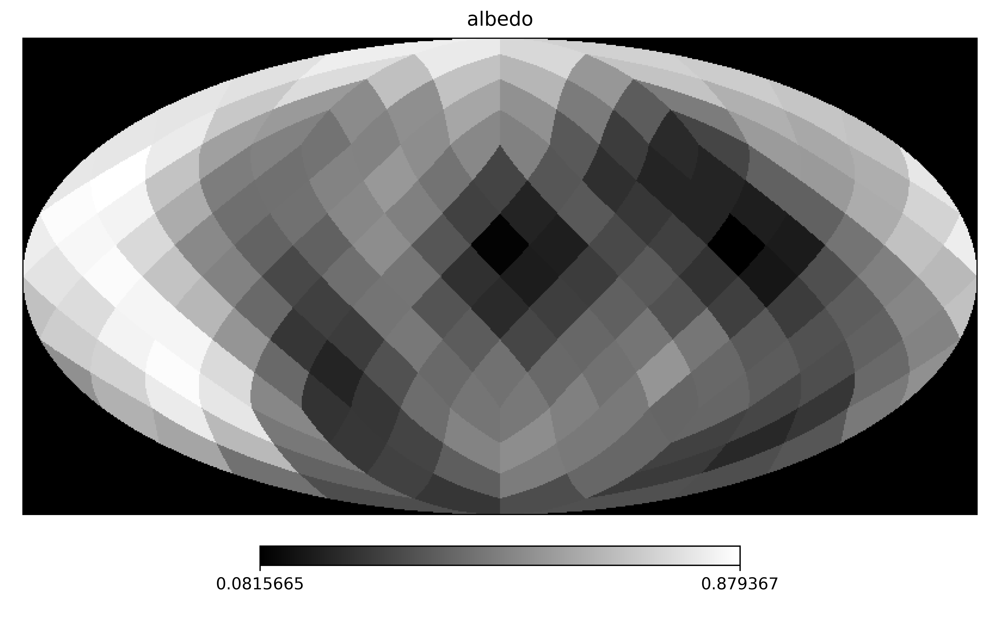
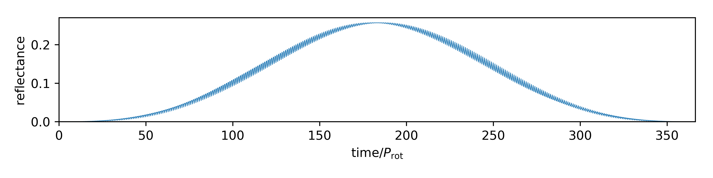

exocartographer
===============

``exocartographer`` is a forward-modeling tool for constraining surface maps
orbital parameters of exoplanets from time-resolved photometry.

Example Usage
-------------

Draw an exoplanet map from the Gaussian Process prior, specify it's orbital
parameters, and generate synthetic light curve data.::

    import numpy as np
    import healpy as hp

    from matplotlib import pyplot as plt

    from exocartographer.gp_map import draw_map
    from exocartographer import IlluminationMapPosterior
    from exocartographer.util import logit, inv_logit

    nside = 4  # map resolution

    # Gaussian process properties
    whitenoise_relative_amp = 0.02
    length_scale = 30. * np.pi/180
    albedo_mean = .5
    albedo_std = 0.2

    # Draw a valid albedo map (i.e., 0 < albedo < 1)
    while True:
        simulated_map = draw_map(nside, albedo_mean, albedo_std,
                                 wn_rel_amp, len_scale)
        if min(simulated_map) > 0 and max(simulated_map) < 1:
            break

    hp.mollview(simulated_map, title='albedo', cmap='gist_gray')

::

    # Set orbital properties
    p_rotation = 23.934
    p_orbit = 365.256363 * 24.0
    phi_orb = np.pi
    inclination = np.pi/2
    obliquity = 90. * np.pi/180.0
    phi_rot = np.pi

    # Observation schedule
    cadence = p_rotation/4.
    epoch_duration = p_orbit
    times = np.linspace(0, epoch_duration, epoch_duration/cadence)

    # Measurement uncertainties
    measurement_std = 0.001

    # Use a posterior instance for easy lightcurve generation
    truth = IlluminationMapPosterior(times, np.zeros_like(times),
                                     measurement_std, nside=nside)

    true_params = {
        'log_orbital_period':np.log(p_orbit),
        'log_rotation_period':np.log(p_rotation),
        'logit_cos_inc':logit(np.cos(inclination)),
        'logit_cos_obl':logit(np.cos(obliquity)),
        'logit_phi_orb':logit(phi_orb, low=0, high=2*np.pi),
        'logit_obl_orientation':logit(phi_rot, low=0, high=2*np.pi)}
    truth.fix_params(true_params)

    p = np.concatenate([np.zeros(truth.nparams), simulated_map])
    lightcurve = truth.lightcurve(p)

    plt.figure(figsize=(16, 3))
    plt.plot(times/p_rotation, lightcurve, lw=0.5)
    plt.xlim(0, p_orbit/p_rotation)
    plt.ylim(ymin=0)
    plt.xlabel(r'time$/P_\mathrm{rot}$')
    plt.ylabel('reflectance')

User Guide
----------

.. toctree::
   :maxdepth: 2

   installation
   exocartographer

API Documentation
==================

* :ref:`genindex`
* :ref:`modindex`
* :ref:`search`
