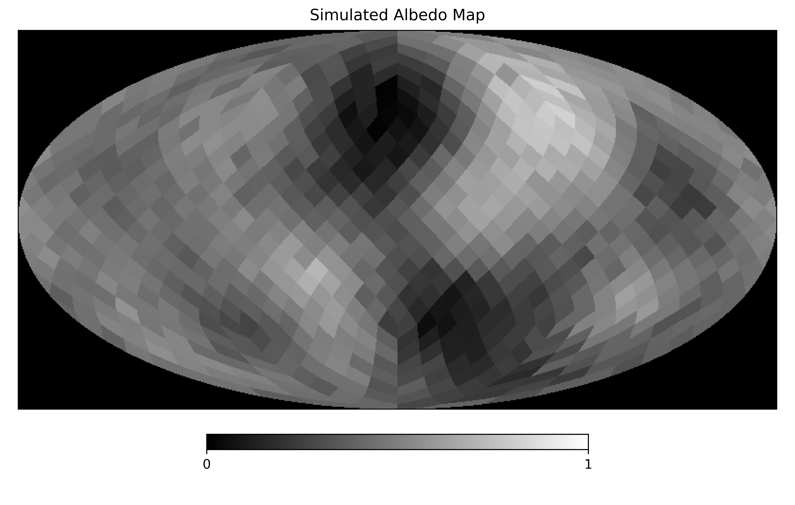
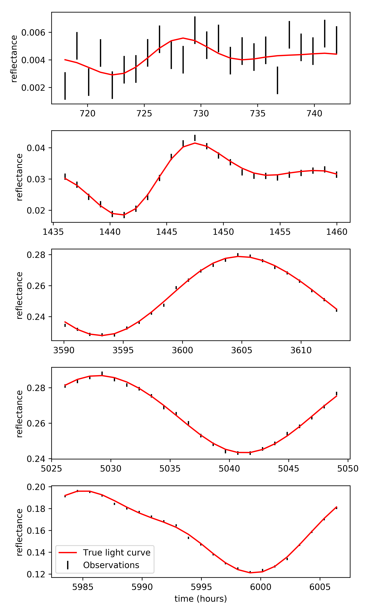
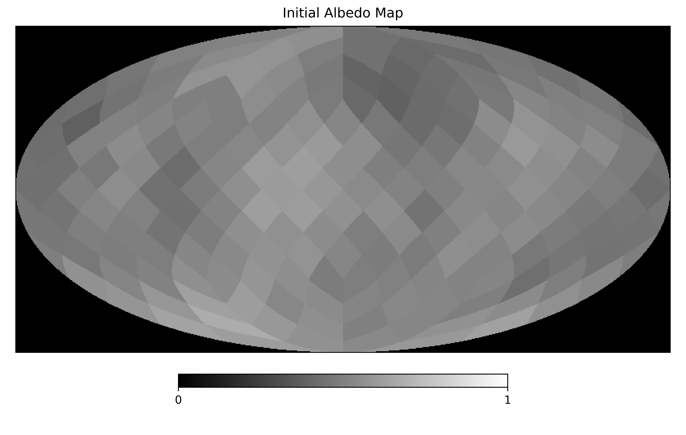
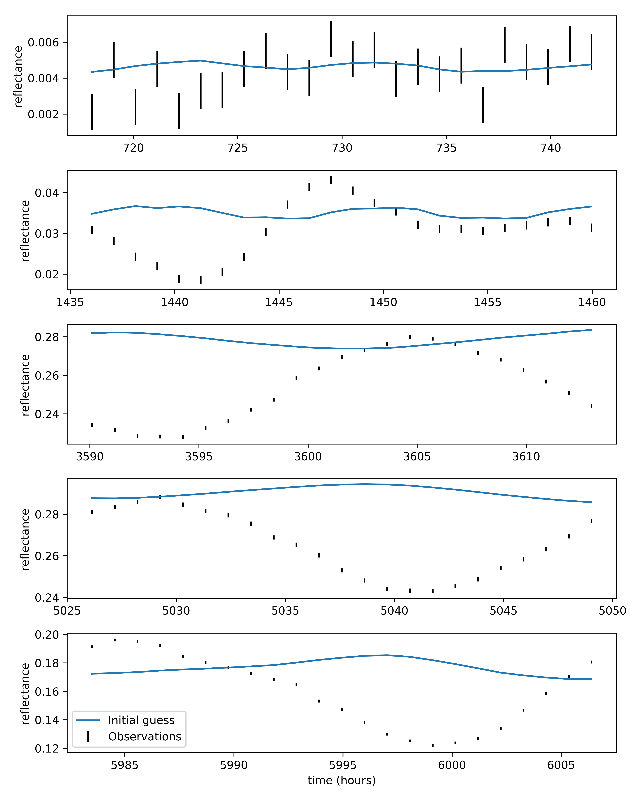
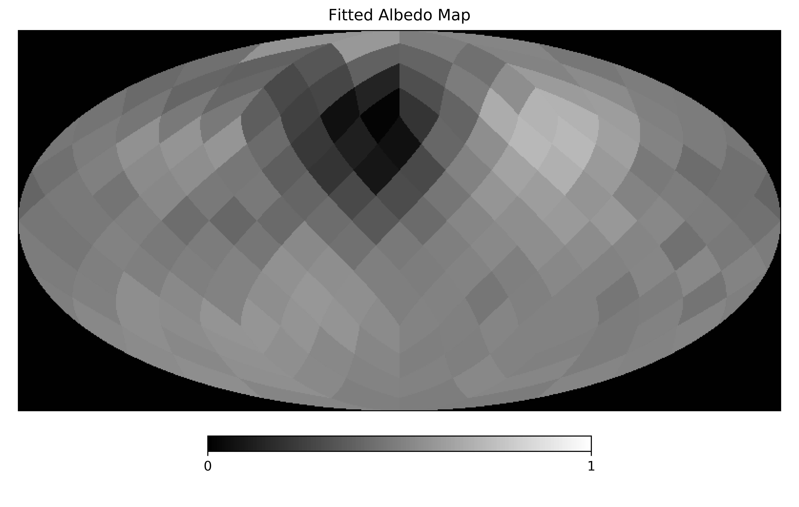
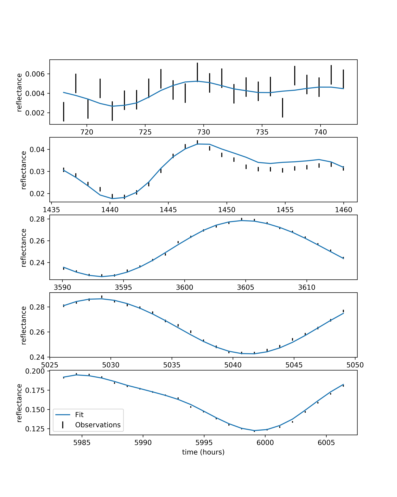

Basic Light Curve Fitting
=========================

To get an idea of building and interacting with the
illumination posterior class, we'll simulate an exoplanet
and photometric observations, and fit the simulated data.

Simulate observations
---------------------

First we need the modules::

    import numpy as np
    import healpy as hp

    from scipy.optimize import minimize

    from matplotlib import pyplot as plt

    from exocartographer.gp_map import draw_map
    from exocartographer import IlluminationMapPosterior
    from exocartographer.util import logit, inv_logit

Now we'll simulate an exoplanet to observe.  We'll define some
properties of the Gaussian process (GP) describing the exoplanet,
specifically the angular length scale of features on the planet
surface (we'll use 30 degrees), mean (0.5) and standard deviation
(0.2) of the kernel, and the relative amplitude of the white noise
on top of the GP::

    sim_nside = 8  # map resolution

    # Gaussian process properties
    sim_wn_rel_amp = 0.02
    sim_length_scale = 30. * np.pi/180
    sim_albedo_mean = .5
    sim_albedo_std = 0.25

    # Draw a valid albedo map (i.e., 0 < albedo < 1)
    while True:
        simulated_map = draw_map(sim_nside, sim_albedo_mean,
                                 sim_albedo_std, sim_wn_rel_amp,
                                 sim_length_scale)
        if min(simulated_map) > 0 and max(simulated_map) < 1:
            break

    hp.mollview(simulated_map, min=0, max=1,
                title='Simulated Albedo Map', cmap='gist_gray')

Now we'll define the orbital properties to simulate (Earth-like
rotational and orbital periods, 90 degree inclination and obliquity), and
the observation schedule (5 epochs, each with 24 hourly observations,
spread over an orbital period)::

    # Set orbital properties
    p_rotation = 23.934
    p_orbit = 365.256363 * 24.0
    phi_orb = np.pi
    inclination = np.pi/2
    obliquity = 90. * np.pi/180.0
    phi_rot = np.pi

    # Observation schedule
    cadence = p_rotation/24.
    nobs_per_epoch = 24
    epoch_duration = nobs_per_epoch * cadence

    epoch_starts = [30*p_rotation, 60*p_rotation, 150*p_rotation,
                    210*p_rotation, 250*p_rotation]

    times = np.array([])
    for epoch_start in epoch_starts:
        epoch_times = np.linspace(epoch_start,
                                  epoch_start + epoch_duration,
                                  nobs_per_epoch)
        times = np.concatenate([times, epoch_times])

To generate the simulated observations we'll make use of the
`IlluminationMapPosterior`, fixing the orbital parameters and using the
simulated map to generate the true light curve.  To simulate actual
observations we'll add a normally distributed component with a
fractional standard deviation of `0.001`::

    measurement_std = 0.001

    truth = IlluminationMapPosterior(times, np.zeros_like(times),
                                     measurement_std, nside=sim_nside)

    true_params = {
        'log_orbital_period':np.log(p_orbit),
        'log_rotation_period':np.log(p_rotation),
        'logit_cos_inc':logit(np.cos(inclination)),
        'logit_cos_obl':logit(np.cos(obliquity)),
        'logit_phi_orb':logit(phi_orb, low=0, high=2*np.pi),
        'logit_obl_orientation':logit(phi_rot, low=0, high=2*np.pi)}
    truth.fix_params(true_params)
    p = np.concatenate([np.zeros(truth.nparams), simulated_map])

    true_lightcurve = truth.lightcurve(p)
    obs_lightcurve = true_lightcurve.copy()
    obs_lightcurve += truth.sigma_reflectance * np.random.randn(len(true_lightcurve))

This is the data we have to fit::

    fig, axs = plt.subplots(len(epoch_starts), 1,
                            figsize=(6, 2*len(epoch_starts)))

    for ax, epoch_start in zip(axs, epoch_starts):
        sel = (times >= epoch_start) & \
                (times - epoch_start < epoch_duration)
        ax.plot(times[sel], true_lightcurve[sel],
                color='r', label='True light curve')
        ax.errorbar(times[sel], obs_lightcurve[sel],
                    truth.sigma_reflectance[sel],
                    capthick=0, fmt='o', markersize=0,
                    color='k', label='Observations')

        ax.set_ylabel('reflectance')
    axs[-1].set_xlabel('time (hours)')
    axs[-1].legend(loc='lower left')

Fitting observations
--------------------

With simulated observations in hand we can now try to fit the albedo map
of the planet, where by "fit" we mean generate a point estimate for the
albedo map parameters by maximizing the posterior probability density.
To do this we'll create an `IlluminationMapPosterior` instance with
a resolution of :math:`N_\mathrm{side}=4`::

    nside = 4
    logpost = IlluminationMapPosterior(times, obs_lightcurve,
                                       measurement_std,
                                       nside=nside, nside_illum=4)

Here we set `nside_illum=nside`, which sets the resolution of the
illumination kernel.  Nature uses an infinite resolution for this, but
that's expensive to simulate.  A high resolution here is ideal (e.g.,
`16`); resolutions too low cause unphysical short-timescale variations
in the light curve.  We're not looking for a rigorous fit here, so `4`
should do.

We'll just focus on fitting the map for now, so we'll fix the orbital
parameters to their simulated values.  The posterior class by default
doesn't trust observers, and adds an extra parameter that scales the
measurement uncertainties.  For now we'll trust our own uncertainties and
fix this parameter to `1.`::

    fix = true_params.copy()
    fix['log_error_scale'] = np.log(1.)

    logpost.fix_params(fix)

Let's pick some random starting values for the unfixed parameters::

    p0 = np.random.randn(logpost.nparams)

    mu0 = 0.5
    sigma0 = .1
    wn_amp0 = 0.05
    scale0 = np.random.lognormal()

    while True:
        map0 = draw_map(nside, mu0, sigma0, wn_amp0, scale0)
        if min(map0) > 0 and max(map0) < 1:
            break

    pnames = logpost.dtype.names
    p0[pnames.index('mu')] = mu0
    p0[pnames.index('log_sigma')] = np.log(sigma0)
    p0[pnames.index('logit_wn_rel_amp')] = logit(wn_amp0,
                                                 logpost.wn_low,
                                                 logpost.wn_high)
    p0[pnames.index('logit_spatial_scale')] = logit(scale0,
                                                    logpost.spatial_scale_low,
                                                    logpost.spatial_scale_high)

    p0 = np.concatenate([p0, map0])
    print("log(posterior): {}".format(logpost(p0)))

We're not being careful with drawing initial parameters here, so make
sure the `log(posterior)` is finite before attempting to fit the data.

Let's see where we're starting from::

    fig, axs = plt.subplots(len(epoch_starts), 1,
                            figsize=(8, 2*len(epoch_starts)))

    for ax, epoch_start in zip(axs, epoch_starts):
        sel = (logpost.times >= epoch_start) & \
                (logpost.times - epoch_start < epoch_duration)
        ax.errorbar(times[sel], logpost.reflectance[sel],
                    logpost.sigma_reflectance[sel],
                    capthick=0, fmt='o', markersize=0, color='k',
                    label='Observations')
        ax.plot(logpost.times[sel], logpost.lightcurve(p0)[sel],
                label='Initial guess')

        ax.set_ylabel('reflectance')
    axs[-1].set_xlabel('time (hours)')
    axs[-1].legend(loc='lower left')

    hp.mollview(logpost.hpmap(p0), min=0, max=1,
                title='Initial Albedo Map', cmap='gist_gray')

We're finally ready to fit.  For this we'll use
`scipy.optimize.minimize`.  The posterior is high-dimensional and
unlikely to be smooth. We've found using the `BFGS` and `Powell` methods sequentially to be
reasonably efficient::

    p_fit = minimize(lambda x: -logpost(x), p0, method='BFGS').x
    p_fit = minimize(lambda x: -logpost(x), p_fit, method='powell',
                     options={'ftol':0.01}).x

Giving us:

There is a convenience function for doing that uses a callback function
to show how the fit progresses.  It can be used in a Jupyter notebook in
the following way::

    import exocartographer.visualize as ev
    ev.inline_ipynb()

    p_fit = ev.maximize(logpost, p0,
                        epoch_starts=epoch_starts,
                        epoch_duration=epoch_duration)

Due to the complexity of the problem this is almost certainly not the
global maximum, and for that reason we have avoided calling this a
"best" fit.  This is merely meant to serve as an illustrative example
for building and evaluating a posterior function, to help you work
toward more robust optimization, or better yet uncertainty
quantification!
